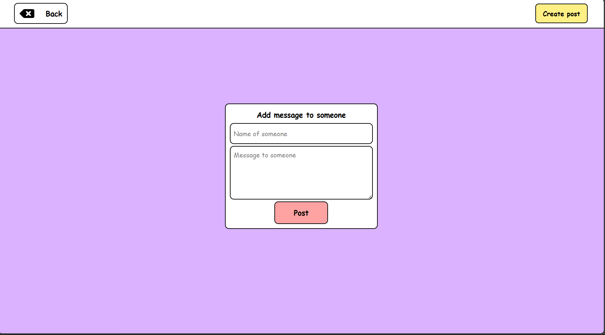

# forSomeone

forSomeone is a web application that allows users to post messages anonymously. Built with React, Node.js, Express, and MongoDB, this app ensures privacy while enabling meaningful anonymous interactions. Users can generate unique avatars using DiceBear to represent their anonymous identity.

## Features

- **Anonymous Posting** – Users can create and share messages without revealing their identity.
- **Unique Avatars** – Automatically generate avatars using DiceBear.
- **Real-time Updates** – Seamless and instant post updates with React.
- **Secure Backend** – Powered by Node.js, Express, and MongoDB for data storage.
- **Responsive UI** – Designed for mobile and desktop devices.

## Tech Stack

- **Frontend**: React.js, Tailwind CSS
- **Backend**: Node.js, Express.js
- **Database**: MongoDB
- **Avatar Generation**: DiceBear API

## Installation

### Prerequisites
- Node.js & npm installed
- MongoDB set up (local or cloud)

### Setup

1. Clone the repository:
   ```sh
   git clone https://github.com/yourusername/forsomeone.git
   cd forsomeone
   ```

2. Install dependencies:
   ```sh
   npm install
   cd client
   npm install
   ```

3. Create a `.env` file in the root directory and add:
   ```env
   MONGO_URI=your_mongodb_connection_string
   PORT=5000
   ```

4. Start the backend server:
   ```sh
   npm run server
   ```

5. Start the frontend:
   ```sh
   cd client
   npm start
   ```

## API Endpoints

| Method | Endpoint    | Description        |
|--------|------------|--------------------|
| GET    | `/posts`   | Get all posts      |
| POST   | `/posts`   | Create a new post  |
| DELETE | `/posts/:id` | Delete a post |

## Screenshots

Here are some screenshots of the application:





## Contribution

1. Fork the repository
2. Create a new branch (`feature/new-feature`)
3. Commit changes
4. Open a pull request

## License

MIT License

